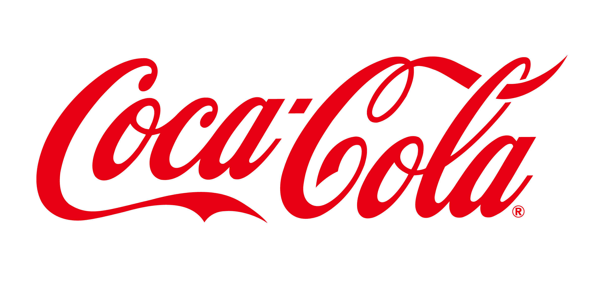
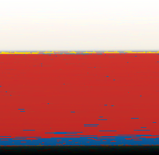

# Color Pallete Generator

- [Live Demo](https://unknownpgr.github.io/color-palatte)

뜬금없이, 이미지의 모든 픽셀을 적절한 기준에 따라 보여주면 어떨까 하는 생각이 들었다. 다음과 같은...크게 쓸데는 없지만 재미있는 프로젝트를 해 볼 수 있지 않을까?

- 여러 브랜드의 로고가 어떤 색들을 썼는지 알아보기
- 화려한 그림들 색 분석

# Results

#### 스타벅스

#### 코카콜라

#### 마스터카드

#### 버거킹

#### 나사

---

#### 밀레

#### 몬드리안

#### 고흐

#### 뭉크

#### 달리

